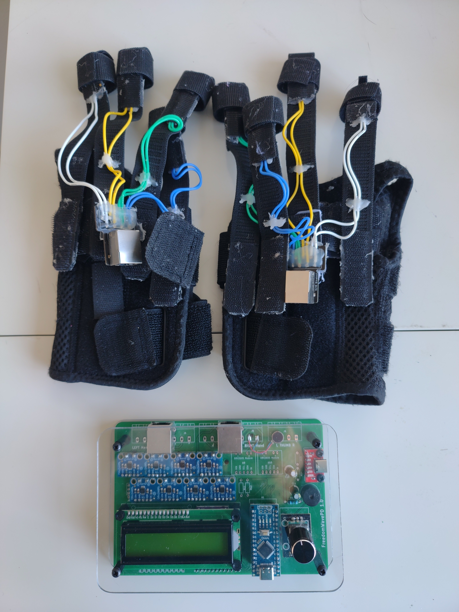

# FreedomWavePD
An open source version of the equipment used by researchers to treat Parkinson's Disease.

Like many others, one morning I was watching the news and saw a story about Dr. Peter Tass at Stanford who was using vibrating gloves to treat Parkinson's Disease with amazing results. Realizing it might be years before they become available, I decided to make my own. What should have been a month of work stretched out to 8 months as I have very limited spare time. 

The theory of these gloves is relatively simple. You attach a device that either vibrates or physically pushes a small pin into the skin (NOT breaking the skin) to each finger, minus the thumbs (8 in total). These are activated in specific random patterns. The vibration triggers nerves in the fingers and these nerves go up to the brain. When these nerves are triggered in certain patterns, they can, in simple terms, help the brain straighten itself out. Look at Dr. Tass's work for much more detail.

The design goals were to make everything as flexible and adjustable as possible. While the results seem incredible, the researchers don't necessarily know the best settings yet. The gloves I constructed are bulky and awkward to put on but have the advantage of being able to put the vibrator anywhere on the fingertip. The circuit uses 8 DRV2605L haptic driver ic's The final PCB version will have room for 10 DRV2605L's in case there may be a benefit to using the thumbs. While these are more expensive than simple transistor drivers, they will easily drive both ERM and LRA vibrators.

Another design goal was to make this as easy as possible to make. I originally had hoped this could be done without soldering, but this just doesn't seem likely. My intention is that you will be able to order a PCB and all components, solder mostly modules to the PCB, and make the gloves. i will have step by step directions for making everything. If you want to make them now, you'll need more skill and knowledge.

What are ERM and LRA motors? ERM stands for Eccentric Mass Motors. Basically, they are motors that spin, and have an unbalanced weight on the output. When you add electricity, the motors spin, and they vibrate. LRA work a little differently. Linear Resonant Actuators have a magnet on a spring and a coil. If you have seen how loudspeakers work, these work on a very similar principle. When you add voltage, the coil generates a magnetic field and either repulses or attracts the magnet. If you reverse the polarity, the magnet is either attracted or repulsed, based on the polarity. If you keep alternating the polarity, the magnet will keep moving back and forth. While you can alternate the current at any frequency you want, these tend to resonate at specific frequencies and work best when you drive them at their resonant frequency.

The current state of the project is that the code works and does the bare minimum. It implements all the patterns properly (I spent a LOT of time making sure randomness and jitter were spot on), but there is no menu to adjust anything. I'll be adding the menu structure soon. When you turn it on, it does a self-test, tells all the driver chips to calibrate to LRA vibrators, and runs treatment for 90 minutes. 

The code is written in BASCOM BASIC, available at https://www.mcselec.com/ . It's not free but if you want to easily program microcontrollers it's worth every penny. I purchased a license over 20 years ago and I can't recommend it enough.

The schematic is in the Hardware folder. It looks complicated but it's mainly just wires. If you're not inclined to make this point-to-point, I should have a PCB ready to go by the middle of September. Be aware the schematic includes a lot of stuff you may not need. Multiple connectors are added for the haptic actuators. You only need one. Also, I added driver IC's for thumbs. This isn't implemented. It's just there in case thumb actuators turn out to be useful in the future.

When I finsh the PCB I will go back to finishing the software.

DISCLAIMER!!!!!!! I am NOT a Doctor. I don't make any claims that these gloves will do anything, including vibrate.
